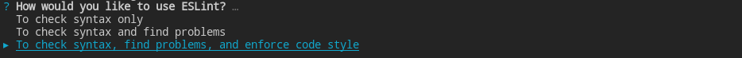
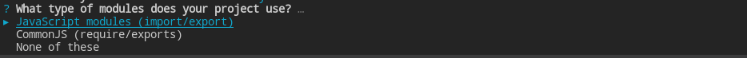
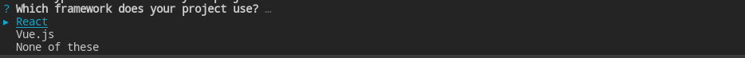
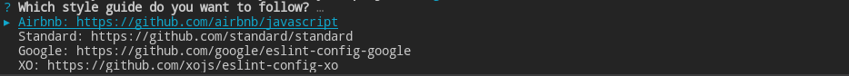
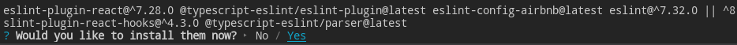
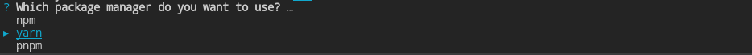

# React + TypeScript の開発環境に webpack-dev-server を追加する

開発

この記事では、導入することで格段に開発効率を上げることができる webpack-dev-server を使った React + TypeScript の開発環境の構築方法をご紹介します。

```shell
$ node -v
v16.15.1

$ yarn -v
1.22.19
```

eslit の設定

```shell
$ yarn create @eslint/config
```

## 1. React + TypeScript のプロジェクトを作成する

プロジェクトのひな形を [create-react-app](https://create-react-app.dev/) を使用して作成します。

`create-react-app` は、Facebook 社製の React プロジェクト作成を自動化するコマンドラインツールです。v2.1.0 で TypeScript をサポートするようになりました。以下の例では、`react-server` というプロジェクト名で作成しています。

- インストール方法

  ```shell
  $ yarn global add create-react-app
  ```

- 使用方法
  ```shell
  $ yarn create react-app react-server --template typescript
  ```

## 2. eslint, prettier の設定

React および TypeScript のスタイルガイドに準拠させ、一貫した自動フォーマットを行うために EsLint, Prettier に関する設定を行います。

EsLint, Prettier はそれぞれ、JavaScript の Linter, Formatter のディファクトスタンダードです。

EsLint は、コードを静的解析をし、バグやスタイルガイドに準拠していない部分を検知するのに役立ちます。一方、Prettier は、コードスタイルを統一することを目的としています。コードスタイルを統一することでコードスタイルの違いによる議論を避けることができるため、重要なツールです。

eslint, prettier は、create-react-app によりすでにインストールされているので早速、設定を行っていきます。

### eslint の設定

eslint の設定は、次のコマンドを実行して対話形式で行います。

```shell
$ yarn create @eslint/config
```

以下のように質問に答えていきます。

1.  コードをチェックする範囲
    
2.  モジュール  
     ウェブブラウザがデフォルトで採用している ES Modules をします。
    
3.  UI フレームワーク  
    React を選択します。
    
4.  TypeScript を使用するかどうか  
    Yes を選択します。
    
5.  コードの実行環境  
    この質問に対してはスペースで複数選択が可能です。
    
6.  EsLint の設定ファイルの形式  
    デフォルトを選択します。
    
7.  スタイルガイドの設定方法  
    有名なスタイルガイドを使用するように選択します。
    
8.  スタイルガイドの種類  
    GitHub 上で最も人気のある Airbnb を選択します。
    

9.  追加で必要な依存関係をインストールするか  
    Yes を選択します。
    
10. `9` のインストールで使用するパッケージマネージャ  
    yarn を選択します。
    

すべての質問に答えると EsLint の設定ファイルである`.eslintrc.js`が作成されます。

### Prettier の設定

プロジェクト直下に Prettier の設定ファイル `.prettierrc.json`を作成します。

デフォルト設定を使用します。お気に入りの設定がある場合は、変更できます。

```shell
$ echo {} > .prettierrc.json
```

### EsLint, Prettier の競合阻止

eslint に

eslint-config-prettier の

### V

## 3. webpack の導入

## 4. webpack-dev-server の設定

```sh
$ yarn -D add eslint-config-prettier
```

web-dev-server とは、

vscode の

追加する依存関係

- webpack-dev-server の設定ファイル
  https://webpack.js.org/configuration/dev-server/
